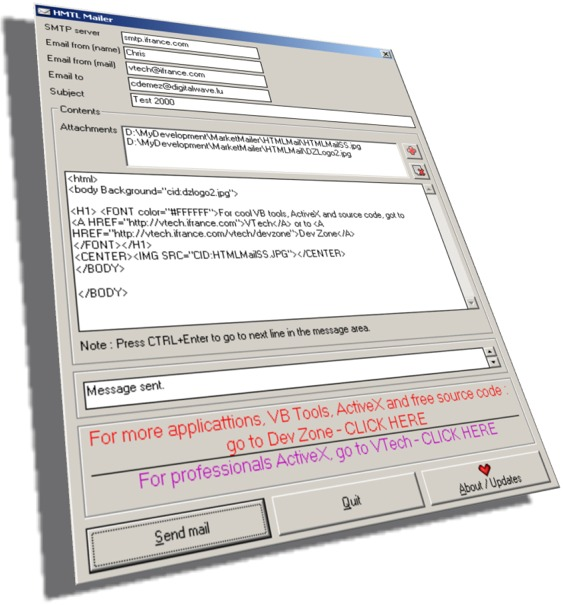



## Mail with images \- send HTML Mail \- V1\.2

### Description

This application allows to send HTML mails !

Now you can send images, formatted text in your mails, put some really cool effects !

Text mail is dead ....

Give a new dimension to your mails, they can

be more attractive.

This application is quite simple and is done

to give an example of how to send a HTML mail.

Add it to your applications ...

and give us feedback.

To download update or have more information go to: http://vtech.ifrance.com/vtech/devzone .  Also, if you vote for us, we will improve it and give you a really cool and complete application with more features. Please vote for me - Thanks
 
### More Info
 

             |
---                |---
**Submitted On**   |2000-08-28 11:08:28
**By**             |[N/A](https://github.com/Planet-Source-Code/PSCIndex/blob/master/ByAuthor/empty.md)
**Level**          |Advanced
**User Rating**    |4.3 (13 globes from 3 users)
**Compatibility**  |VB 6\.0
**Category**       |[Internet/ HTML](https://github.com/Planet-Source-Code/PSCIndex/blob/master/ByCategory/internet-html__1-34.md)
**World**          |[Visual Basic](https://github.com/Planet-Source-Code/PSCIndex/blob/master/ByWorld/visual-basic.md)
**Archive File**   |[CODE\_UPLOAD93618282000\.zip](https://github.com/Planet-Source-Code/mail-with-images-send-html-mail-v1-2__1-11040/archive/master.zip)

